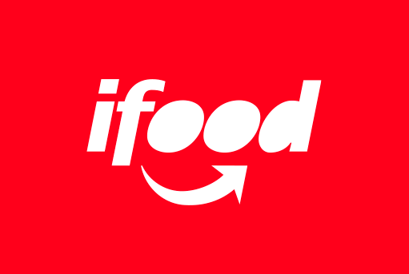

<p align="center">
  
</p>


# iFood Case — Oferta Ótima por Cliente (Uplift + Custo)

Este repositório contém o estudo, os modelos e os entregáveis do **Case iFood** para construir uma **política de ofertas por cliente** que **maximiza margem líquida incremental** sob **restrições de custo**. O projeto combina: (i) modelagem de **probabilidade de visualização** (propensão a ver a oferta), (ii) **CATE** (efeito causal condicional) em **margem líquida**, e (iii) uma **regra de decisão** por cliente/oferta que considera **benefício incremental esperado vs. custo**.

> **Stack**: Python 3.x, CatBoost, scikit-learn, causalml (ou implementação própria de meta-learners), pandas, numpy, plotly.  
> **Reprodutibilidade**: `environment.yml` / `requirements.txt`. Arquivos grandes/notebooks em **Git LFS**.


---

## 1) Estrutura do repositório

```
.
├─ data/
│  ├─ raw/                      # dados brutos (controle de versão via LFS)
│  ├─ processed/                # dados processados (parquet/csv) para reprodutibilidade
│  └─ samples/                  # amostras de dados (quando aplicável)
├─ notebooks/
│  ├─ 01_data_processing_pandas.ipynb
│  └─ 02_modelagem_politica.ipynb
├─ presentation/
│  ├─ Otimizacao-de-Ofertas-Incremento-de-Margem-Liquida-com-Politica.pptx
│  ├─ policy_sensitivity_3cenarios.csv
│  ├─ pview_importances_top30.png
│  └─ pview_shap_summary.png
├─ src/                         # (opcional) funções utilitárias
├─ export_policy.csv            # **entregável**: política final (cliente → oferta/canal)
├─ environment.yml              # ambiente conda (opcional)
├─ requirements.txt             # dependências pip
├─ notes.txt                    # anotações diversas
└─ README.md                    # este arquivo
```

> **Observação**: alguns arquivos de dados e notebooks são rastreados por **Git LFS** (por exemplo, `*.ipynb`, `data/raw/*.json`) para evitar limites de tamanho no GitHub.


---

## 2) Objetivo do projeto

Construir e avaliar uma **política de comunicação/oferta por cliente** que maximize a **margem líquida incremental** (lift em lucro por envio) levando em conta:
- **Efeito causal** da visualização da oferta sobre a margem (**CATE em margem líquida**);
- **Probabilidade de visualização** (*p_view*), que transforma efeito condicional em **valor esperado por envio**;
- **Custo total estimado por envio** (incentivo + mídia), respeitando um **orçamento** e garantindo **ROI** saudável.


---

## 3) Métricas e resultados principais

- **Uplift AUUC/Qini no piloto** (esperado > 0):  
  - AUUC (SNIPS): `4.360125`  
  - AUUC (DR): `5.506349`  
- **Hit rate da política**: *vide seção de resultados em* `02_modelagem_politica.ipynb` *(campo será atualizado na apresentação)*
- **Margem líquida por 1.000 envios**: *vide notebook e apresentação*
- **OPE (Off-Policy Evaluation)**:
  - Avaliamos **SNIPS** e **DR** para valor esperado por envio, com **ESS** (tamanho efetivo da amostra) e *sum of weights* (sumw).

> As métricas detalhadas por cenário (sensitividade de custo/orçamento) e por segmento estão no `policy_sensitivity_3cenarios.csv` e na apresentação.


---

## 4) Como o **Cost Score** foi construído

O **Cost Score** resume o **custo esperado por envio** de cada par (cliente, oferta). Ele compõe:

1. **Incentivo esperado** da oferta (ex.: desconto, BOGO, etc.) ajustado por:
   - `discount_weight` (peso para converter %/valor de desconto em custo econômico);
   - `type_multiplier` (descontos vs BOGO vs informacional) para refletir distintos impactos no P&L.
2. **Custo de mídia esperado** do canal (quando aplicável), incorporando:
   - `_media_cost_var` como proxy/variância de custo unitário;
   - custo **por impressão / por envio** conforme o canal.

**Fórmula simplificada** (por envio, para um cliente *i* e oferta *j*):
$$
\text{CostScore}_{i,j} = \mathbb{E}[\text{Incentivo}_{i,j}] + \mathbb{E}[\text{CustoMídia}_{i,j}]
$$

> No holdout, usamos esse **CostScore** como **linha de base orçamentária** e, nas simulações, como **restrição** para comparar políticas sob o mesmo teto de custo.


---

## 5) Como a **probabilidade de visualização (p_view)** foi modelada

Treinamos um modelo de propensão para estimar **p_view = P(View=1 | X, oferta)**, com **CatBoost** devido a:
- bom desempenho em dados tabulares heterogêneos;
- suporte nativo a categóricas;
- estabilidade sob *target imbalance* e bons *calibration properties* com *isotonic/logistic calibration* quando necessário.

**Principais pontos do pipeline p_view**:
- **Features**: atributos do cliente, histórico de interações (streaks de *view/no-view*), *lags* e estatísticas de ciclos anteriores (e.g., `prev3c_rate_completed_given_view`, `tempo_relacionamento_anos`, `credit_card_limit`, etc.).
- **Higiene**: checagem de *leakage*, análise de variância baixa, PSI, e SHAP/feature importances (ver `pview_importances_top30.png`, `pview_shap_summary.png`).
- **Splits temporais**: treinos por janelas (train/calib/holdout) para evitar *look-ahead*.
- **Calibração (opcional)**: isotônica/logística se verificada discrepância entre *predicted* e *observed*.

O output é $\hat{p}_{i,j}$ para cada par cliente-oferta no holdout.


---

## 6) CATE em **margem líquida** (efeito causal por cliente)

Estimamos o **efeito causal da visualização** sobre a **margem líquida** (não apenas taxa de conversão), i.e. $\tau_i = \mathbb{E}[Y \mid T=1, X_i] - \mathbb{E}[Y \mid T=0, X_i]$, onde:
- $Y$ = **margem líquida** por envio/ciclo (receita incremental - custos), já **alinhada** ao evento (*view*) e à janela correta;
- $T=1$ indica **visualização** efetiva.

### Meta-learner adotado: **DR-Learner (Doubly Robust)**
**Por quê DR?**
- **Dupla robustez**: consistente se **propensity** (e) **ou** modelos de outcome estiverem corretos;
- **Estabilidade** sob **seleção não-aleatória** e **overlap** imperfeito (com *trimming* de $\hat{e}$ para [0.02, 0.98], quando necessário);
- Flexível para **outcome contínuo** (margem líquida) e **alto número de features**;
- Compatível com **OPE** posterior via SNIPS/DR, usando a mesma escala de *net margin*.

**Detalhes práticos**:
- Remoção de linhas inválidas (NaN/inf) e *trimming* de **propensity $\hat{e}$** para garantir **overlap**;
- *Fallback* constante em *folds* degenerados (quando a variação de $Y$ é nula);
- Logs de **overlap** e diagnóstico de $\hat{e}$.

O output é $\widehat{\tau}^{\text{view}}_{i,j}$, gravado como `tau_view_hat`.


---

## 7) Regra de decisão (a **política**)

Para cada **cliente i** e **oferta j** no holdout, calculamos o **valor incremental esperado por envio**:

$$
\text{Value}_{i,j} = \hat{p}_{i,j} \cdot \widehat{\tau}^{\text{view}}_{i,j} - \text{CostScore}_{i,j}
$$

- $\hat{p}_{i,j}$: propensão a ver a oferta;
- $\widehat{\tau}^{\text{view}}_{i,j}$: efeito causal estimado em **margem líquida** condicionado à visualização;
- $\text{CostScore}_{i,j}$: custo esperado do envio (incentivo + mídia).

**Política por cliente**:  
Escolher a **oferta j** que **maximiza** `Value_{i,j}`, respeitando **restrições de orçamento** (somatório de custos por período/campanha) e **safety rules** (ex.: **excluir** ofertas com `Value_{i,j} < 0` ou **thresholds** mínimos de $\hat{p}$ ou $\tau$).

> **Hit rate da política**: % de casos onde a oferta selecionada **de fato resulta** em visualização/resultado no holdout.  
> **Margem por 1.000 envios**: soma de margens realizadas sob a política, escalada por 1.000.


---

## 8) Avaliação (OPE) — **SNIPS / DR** em margem líquida

Para avaliar a política **sem precisar executá-la integralmente** no mundo real, usamos **Off-Policy Evaluation**:
- **SNIPS**: *Self-Normalized IPS* → reduz variância do IPS clássico;
- **DR**: *Doubly Robust* → combina modelos de outcome com ponderação por propensão.

Relatamos **valor esperado por envio**, **ESS** (tamanho efetivo), e **sumw** (soma dos pesos).  
Métricas **Qini/AUUC** também foram computadas para verificar **ordenação**/ranking de uplift.


---

## 9) Entregáveis (onde encontrar)

- **Política final por cliente (CSV)**: `export_policy.csv`  
  Colunas típicas: `customer_id`, `best_offer_name`, `channel`, `p_view_hat`, `tau_view_hat`, `cost_score`, `value_score`, etc.
- **Relatório/apresentação**: `presentation/Otimizacao-de-Ofertas-Incremento-de-Margem-Liquida-com-Politica.pptx`
- **Sensibilidade de política**: `presentation/policy_sensitivity_3cenarios.csv`
- **Interp. do p_view**: `presentation/pview_importances_top30.png`, `presentation/pview_shap_summary.png`
- **Dados processados** (para auditoria/reprodutibilidade): `data/processed/*.parquet`

> Em alguns cenários, também foi gerado `data/processed/ofertas_por_cliente_por_data_em_holdout.parquet`, útil para auditoria por dia.


---

## 10) Reprodutibilidade — como rodar

### 10.1. Ambiente
Com **conda**:
```bash
conda env create -f environment.yml
conda activate ifood-case
```

Com **pip**:
```bash
python -m venv .venv
source .venv/bin/activate  # (Windows: .venv\Scripts\activate)
pip install -r requirements.txt
```

> **Git LFS**: instale e ative antes de clonar ou *pull* para baixar os *blobs* grandes.
```bash
git lfs install
git lfs pull
```

### 10.2. Passo-a-passo
1. Execute o notebook `notebooks/01_data_processing_pandas.ipynb` para preparar dados e features.
2. Execute o `notebooks/02_modelagem_politica.ipynb` para treinar **p_view**, estimar **CATE**, construir a **política** e gerar os **entregáveis**.
3. Valide as métricas (AUUC/Qini, OPE-SNIPS/DR, hit rate, margem/1000 envios) no final do notebook e/ou na apresentação.


---

## 11) Notas de implementação

- **Overlaps e trimming**: propensidade $\hat{e}$ foi *trimada* para [0.02, 0.98] quando necessário, garantindo qualidade dos estimadores.
- **Fallbacks**: em *folds* com `y` constante, usamos fallback de média para estabilizar meta-learners/estimadores.
- **Escala de margem**: usamos a **mesma escala** de *net margin* entre modelagem e OPE (alinhamento DR).
- **Custos no holdout**: **CostScore** define a **linha de base orçamentária** para comparação justa entre cenários/políticas.
- **Segurança** (*safety rules*): política só escolhe ofertas com `Value_{i,j} > 0` e pode aplicar *caps* de custo por cliente/oferta.

---

## 12) Próximos passos

- Incorporar **canal** explicitamente no *learner* (multi-treatment) ou via dois estágios (oferta → canal).
- Explorar **policy learning** direto (bandits/POEM/a-learning) com restrições de custo.
- **Calibração** global de $\hat{p}$ e $\hat{\tau}$ vs. resultados observados por segmento.
- Aumentar robustez com **cross-fitting** e inferência com **bootstrap** (CIs de *value uplift*).


---

## 13) Licença e contato

- Licença: vide `LICENSE` (a definir).
- Contato: abra uma *issue* no GitHub ou fale com o autor do repositório.
